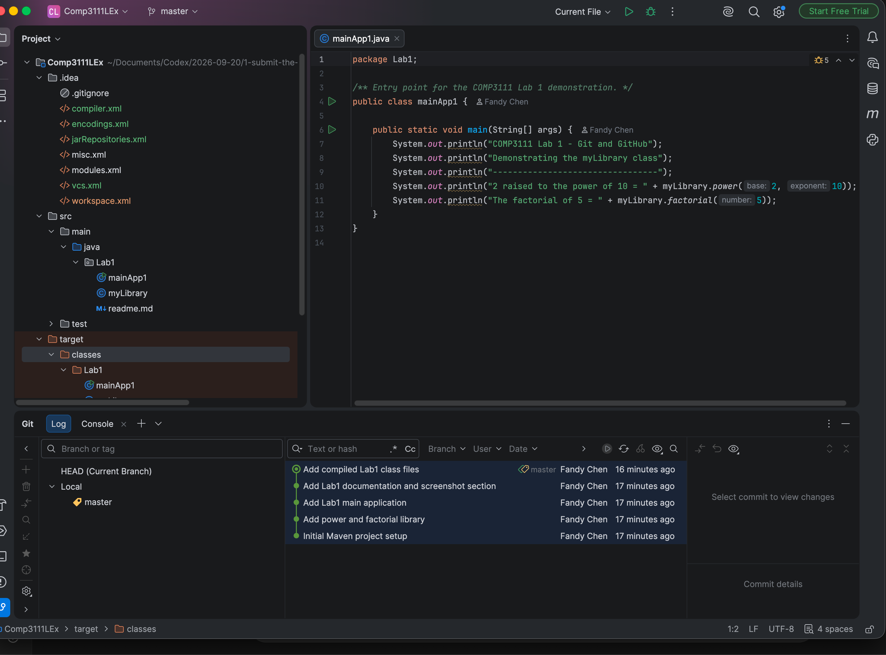

# COMP3111 Lab 1

This folder contains the Java source code for Lab 1 of COMP3111 Software Engineering.

## Files

- `myLibrary.java` provides `power` and `factorial` utility methods.
- `mainApp1.java` demonstrates the utility methods and prints the results.

## Remarks

This exercise demonstrates how to create a Maven project in IntelliJ IDEA, place the project under Git version control, record changes through several commits, and publish the repository on GitHub.

## IntelliJ IDEA project and Git history

The screenshot below shows the expanded `.idea` and `src` project folders, the Java editor, and the Git Log containing more than three commits.

